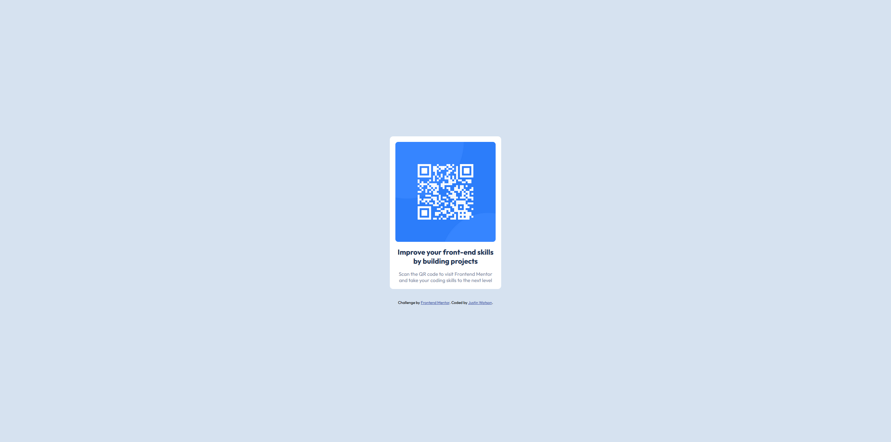

# Frontend Mentor - QR code component solution

This is a solution to the [QR code component challenge on Frontend Mentor](https://www.frontendmentor.io/challenges/qr-code-component-iux_sIO_H). Frontend Mentor challenges help you improve your coding skills by building realistic projects. 

## Table of contents

- [Overview](#overview)
  - [Screenshot](#screenshot)
  - [Links](#links)
- [My process](#my-process)
  - [Built with](#built-with)
  - [What I learned](#what-i-learned)
  - [Continued development](#continued-development)
  - [Useful resources](#useful-resources)
- [Author](#author)
- [Acknowledgments](#acknowledgments)


## Overview

### Screenshot



### Links

- Solution URL: [Github link](https://github.com/Twincasper/qr-code-card-component)
- Live Code URL: [Live Code](https://twincasper.github.io/qr-code-card-component/)

## My process

### Built with

- Semantic HTML5 markup
- CSS custom properties
- Flexbox
- CSS Grid

### What I learned

I learned how to set an entire body as a flex container, so that it is easier to control the general flow and alignment of other flex containers within the body. I also learned the general flow of making a card with html structuring and css styling.

To see how you can add code snippets, see below:

```html
<div id="card">
  
  <h1>Improve your front-end skills by building projects</h1>
  <p>Scan the QR code to visit Frontend Mentor and take your coding skills to the next level</p>
</div>
```
```css
:root {
  --white: hsl(0, 0%, 100%);
  --light-gray: hsl(212, 45%, 89%);
  --grayish-blue: hsl(220, 15%, 55%);
  --dark-blue: hsl(218, 44%, 22%);
}

body {
  display: flex;
  flex-direction: column;
  align-items: center;
  justify-content: center;
  font-family: 'Outfit',sans-serif;
  font-size: 0.9rem;
  background: var(--light-gray);
  height: calc(100vh - 1px);
}
```

### Continued development

I want to refine my understanding of the viewport, and how to make media queries for mobile layouts properly.

### Useful resources

- [Article explaining how to make card components](https://www.makeuseof.com/card-components-html-css/) - This helped me understand the general flow of making a card with css.

## Author
- Frontend Mentor - [@Twincasper](https://www.frontendmentor.io/profile/Twincasper)

## Acknowledgments

My people at the Marcy Lab School for providing me the space that motivates me to work on stuff like this in my free time. Love y'all. &#128150;

